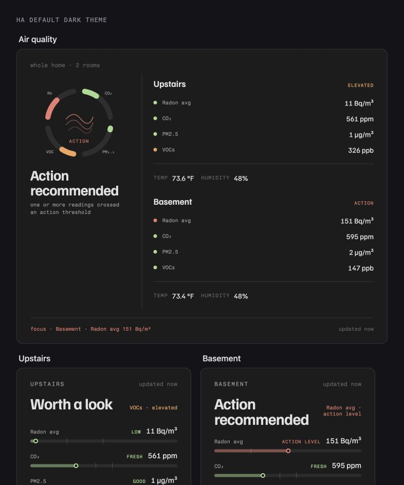
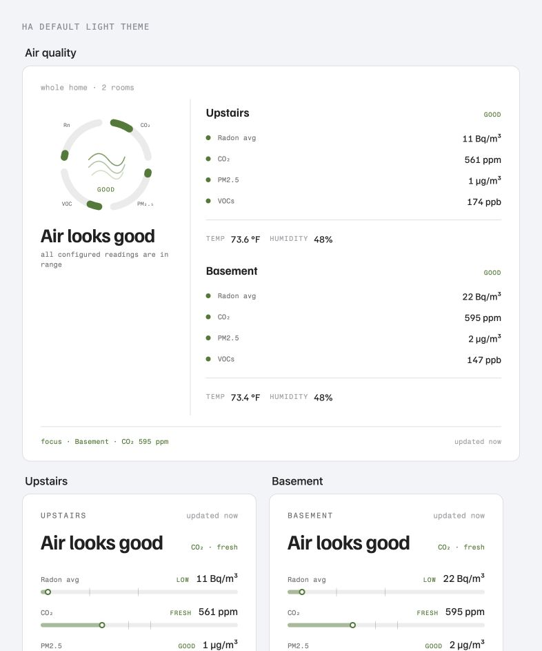

# Air Quality Cards

Five custom Lovelace cards for Home Assistant that turn indoor-air sensors into a calm,
room-first dashboard. They share the visual language of
[Sun Cards](https://github.com/tkamenick/lovelace-sun-cards): the same typography, theme-aware
surfaces, compact telemetry, restrained accent colors, responsive behavior, and one strong
visual hierarchy instead of a wall of unrelated gauges.



The cards also adapt their accents for light themes:



| Card | Type | What it answers |
|---|---|---|
| **Overview** | `custom:air-quality-cards-overview` | Is the house okay, which room needs attention, and which pollutant is driving the status? |
| **Room** | `custom:air-quality-cards-room` | What is happening in this room, and where does each reading sit in its configured range? |
| **Radon** | `custom:air-quality-cards-radon` | How do rooms compare to the action level, and what long-term average should I judge? |
| **Trend** | `custom:air-quality-cards-trend` | How have one room's differently-scaled pollutants moved over the last day? |
| **Radon Trend** | `custom:air-quality-cards-radon-trend` | How do daily radon means and maxima compare across rooms and to the action level? |

All five are dependency-free and bundled in one file. Clicking any configured reading opens
Home Assistant's normal more-info dialog.

## Install with HACS

1. HACS → three-dot menu → **Custom repositories**
2. Repository: `https://github.com/tkamenick/lovelace-air-quality-cards` · Type: **Dashboard**
3. Install **Air Quality Cards**, then reload the browser when prompted.

For a manual install, copy `air-quality-cards.js` to `/config/www/` and add
`/local/air-quality-cards.js` as a JavaScript module dashboard resource.

## Room configuration

Every card uses the same room shape. Only `name` is presentation; every sensor is optional.
The card shows a clean unavailable state when an entity is omitted, missing, `unknown`, or
`unavailable`.

```yaml
room:
  name: Upstairs
  radon: sensor.upstairs_radon
  radon_average: sensor.upstairs_radon_30d_average # optional
  co2: sensor.upstairs_co2
  pm25: sensor.upstairs_pm2_5
  voc: sensor.upstairs_voc
  temperature: sensor.upstairs_temperature
  humidity: sensor.upstairs_humidity
```

The Overview and Radon cards take a `rooms:` list instead. See
[`examples/air-quality-view.yaml`](examples/air-quality-view.yaml) for a complete two-room
sections dashboard with matching recorder-backed room and radon history cards.

When `radon_average` is configured, the Overview and Room cards use that average for their
status, dial, and focus callout. The Radon card still shows the live reading and presents the
average beneath it. This keeps a short-lived radon swing from driving the whole-house status.

## Default ranges

Every boundary can be overridden. Defaults are intentionally simple three-state ranges; color
is always paired with a text label.

| Metric | Good / low | Elevated / consider | Action / high | Display max |
|---|---:|---:|---:|---:|
| Radon | 0–74 Bq/m³ | 75–147 Bq/m³ | ≥148 Bq/m³ | 300 Bq/m³ |
| CO₂ | 0–800 ppm | 801–999 ppm | ≥1000 ppm | 1800 ppm |
| PM2.5 | 0–9.0 µg/m³ | 9.1–35.4 µg/m³ | ≥35.5 µg/m³ | 75 µg/m³ |
| VOC | 0–250 ppb | 251–499 ppb | ≥500 ppb | 1000 ppb |

The radon card marks the U.S. EPA recommendation to fix a home at or above 148 Bq/m³ and keeps
the reminder to judge radon over time, not from one swing. The PM2.5 defaults mirror the EPA's
2024 Good and Moderate AQI concentration breakpoints. Health Canada uses 1000 ppm as a 24-hour
residential CO₂ exposure limit and ventilation indicator. Those official references use
averaging periods; a live sensor value is context, not a diagnosis or a calculated AQI.

- [EPA radon action level](https://www.epa.gov/radiation/radionuclide-basics-radon)
- [EPA 2024 PM2.5 AQI breakpoints](https://www.epa.gov/system/files/documents/2024-02/pm-naaqs-air-quality-index-fact-sheet.pdf)
- [Health Canada residential CO₂ guidance](https://www.canada.ca/en/health-canada/services/publications/healthy-living/carbon-dioxide-home.html)

VOC scales vary substantially by sensor and firmware, so the included VOC range is only a
starting point. Tune it to the device manufacturer's guidance and the behavior of your home.

```yaml
type: custom:air-quality-cards-overview
rooms: # ...
thresholds:
  radon:
    good: 74
    action: 148
    max: 300
  co2:
    good: 800
    action: 1000
    max: 1800
  pm25:
    good: 9
    action: 35.5
    max: 75
  voc:
    good: 250
    action: 500
    max: 1000
```

Thresholds must satisfy `good < action <= max`.

## Card examples

### Whole-home overview

```yaml
type: custom:air-quality-cards-overview
rooms:
  - name: Upstairs
    co2: sensor.upstairs_co2
    pm25: sensor.upstairs_pm2_5
    voc: sensor.upstairs_voc
    temperature: sensor.upstairs_temperature
    humidity: sensor.upstairs_humidity
  - name: Basement
    radon: sensor.basement_radon
    co2: sensor.basement_co2
    pm25: sensor.basement_pm2_5
    voc: sensor.basement_voc
    temperature: sensor.basement_temperature
    humidity: sensor.basement_humidity
```

### Room history

The Trend card requests Home Assistant recorder statistics directly. Each metric gets its own
small-multiple line and threshold scale, so a 550 ppm CO₂ series does not flatten a 2 µg/m³
PM2.5 series. No extra chart integration is required.

```yaml
type: custom:air-quality-cards-trend
name: Upstairs trend
hours_to_show: 24
period: 5minute
room:
  name: Upstairs
  co2: sensor.upstairs_co2
  pm25: sensor.upstairs_pm2_5
  voc: sensor.upstairs_voc
```

For advanced layouts, provide `series:` instead of `room:`. Every series needs an entity and a
metric so the card can apply the right unit, color, and thresholds.

```yaml
type: custom:air-quality-cards-trend
name: Workshop trend
series:
  - entity: sensor.workshop_carbon_dioxide
    name: CO₂
    metric: co2
  - entity: sensor.workshop_pm2_5
    name: PM2.5
    metric: pm25
```

### Radon history

```yaml
type: custom:air-quality-cards-radon-trend
name: Radon history
days_to_show: 30
period: day
show_max: true
rooms:
  - name: Basement
    radon: sensor.basement_radon
  - name: Upstairs
    radon: sensor.upstairs_radon
```

The solid lines are daily means; optional dashed lines are daily maxima. The chart always marks
the configured radon action threshold. Both trend cards refresh recorder data automatically and
show a calm empty state when statistics are unavailable.

The Overview and Radon cards request `rows: auto` because both switch from side-by-side to
stacked layouts based on their own rendered width. The Room card requests seven section-grid
rows so a wrapped status line cannot clip its footer. Both Trend cards also request `rows: auto`.

## Development

`dev/harness.html` renders the full set in dark and light themes, including an alert state and
a 360 px phone-width Overview card. Serve the repository root and open the harness:

```bash
python3 -m http.server 8811
```

Useful query parameters:

| Parameter | Effect |
|---|---|
| `row=dark` / `row=light` | Show one theme |
| `show=overview` / `show=cards` / `show=charts` / `show=phone` / `show=dashboard` | Isolate a card group or hide the phone duplicate |
| `scenario=healthy` / `scenario=alert` / `scenario=partial` | Stage sensor states |

## License

MIT
